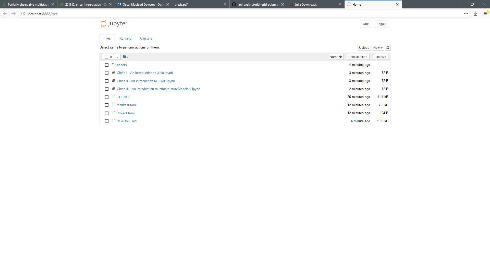

# Grid Science Winter School Tutorial

This repository contains materials for the Julia/JuMP tutorial at the Los Alamos
Grid Science Winter School, 2019.

This README will walk you through how to install Julia and JuMP.

To get started, you first need to install Julia.

 - Download and install Julia v1.0.2 from [https://julialang.org/downloads/](https://julialang.org/downloads/).

Next, you need to download a copy of these materials.

 - If you have `git`
installed, (after `cd`'ing to an appropriate directory) run
```
git clone https://github.com/lanl-ansi/tutorial-grid-science-2019
```
 - If you don't have `git` installed (i.e., the above command fails), [download this zip file](https://github.com/lanl-ansi/tutorial-grid-science-2019/archive/master.zip). Once downloaded, unzip it to an appropriate location.


Now open Julia.
 - If you are familiar with a terminal, run
 ```
 julia --project=/path/to/tutorial-grid-science-2019
 ```
 - If you are not familiar with a terminal, open Julia, and then run
 ```julia
 julia> cd("/path/to/tutorial-grid-science-2019")

 julia> import Pkg

 julia> Pkg.activate(".")
 ```

Once Julia is open, update your packages as follows:
 ```julia
 import Pkg
 Pkg.update()

 ```

Because Julia is just-in-time compiled (more on this in the tutorial), the first time you use some Julia code it needs to perform some compilation. To get this out of the way, run
```julia
using JuMP
using GLPK
using Ipopt
using IJulia
```

!!! note
  If `using IJulia` fails, run `Pkg.build("IJulia")`, then close Julia and re-open following the steps above.

Okay, last step, let's launch a Jupyter notebook!
```julia
using IJulia
IJulia.notebook(dir=".")
```

If all goes well, a browser window will open that looks like this:



To get started on the content portion of the tutorials, click on the first notebook entitled `Class I - An introduction to Julia`.
